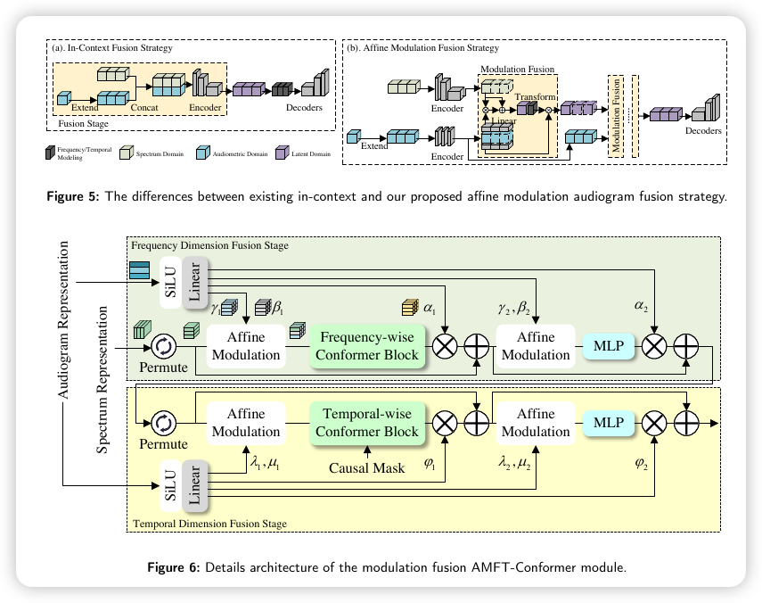

<p align="center">
  <h1 align="center">Affine Modulation-based Audiogram Fusion Network for Joint Noise Reduction and Hearing Loss Compensation</h1>
  <p align="center">
    Ye Ni, Ruiyu Liang<sup>†</sup>, Xiaoshuai Hao<sup>†</sup>, jiaming Cheng, Qingyun Wang<br>
    Chengwei Huang, Cairong Zou, Wei Zhou, Weiping Ding, Björn W. Schuller
  </p>
  <p align="center" >
    <em>School of Information
Science and Engineering, Southeast University, Nanjing, China<br> School of Communication Engineering, Nanjing Institute of Technology, Nanjing, China<br> Xiaomi EV, Xiaomi Campus, Beijing, China<br> Cardiff University, Cardiff, United Kingdom<br> School of Artificial Intelligence and Computer Science, Nantong University, Nantong, China<br> CHI — Chair of Health Informatics, Technical University of Munich University Hospital, Munich, Germany<br> GLAM — Group on Language, Audio, \& Music, Imperial College London, London, United Kingdom</em>
  </p>
  <p align="center">
    <a href='https://arxiv.org/abs/2509.07341'>
      
    </a>
  </p>
  <p align="center">
    
  </p>
</p>

This is the official code repository for ["Affine Modulation-based Audiogram Fusion Network for Joint Noise Reduction and Hearing Loss Compensation".](https://arxiv.org/abs/2509.07341) If you find our work useful for your research and applications, please cite using this BibTeX:

```bibtex
@article{ni2025affine,
  title={Affine Modulation-based Audiogram Fusion Network for Joint Noise Reduction and Hearing Loss Compensation},
  author={Ni, Ye and Liang, Ruiyu and Hao, Xiaoshuai and Cheng, Jiaming and Wang, Qingyun and Huang, Chengwei and Zou, Cairong and Zhou, Wei and Ding, Weiping and Schuller, Bj{\"o}rn W},
  journal={arXiv preprint arXiv:2509.07341},
  year={2025}
}
```


**Project Files and Tools Description:**

- `model/AFN-HearNet.py` is the model source code.

- `tools/PyFIG6/pyFIG6.py` provides APIs for loudness compensation based on the FIG6 fitting algorithm.
- `tools/PyHASQI/HASQI_revised.py` implements computation of the HASQI metric using the NumPy library.
- `data/Patient_Information` contains the hearing-impaired audiograms used in our work.


**Audio File Naming Convention:**

For each test audio, there are four files, each suffixed with `_src`, `_nearend`, `_nearend_fig6`, and `_target`. 
Among them:

- `_src` is the original clean audio;
- `_nearend` indicates the file containing noisy;
- `_nearend_fig6` refer to the noisy file compensated by FIG6;
- `_target` is the target compensated and denoised audio.
